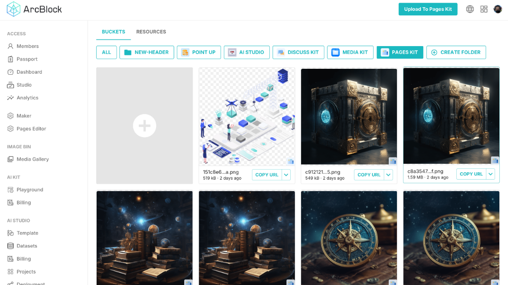
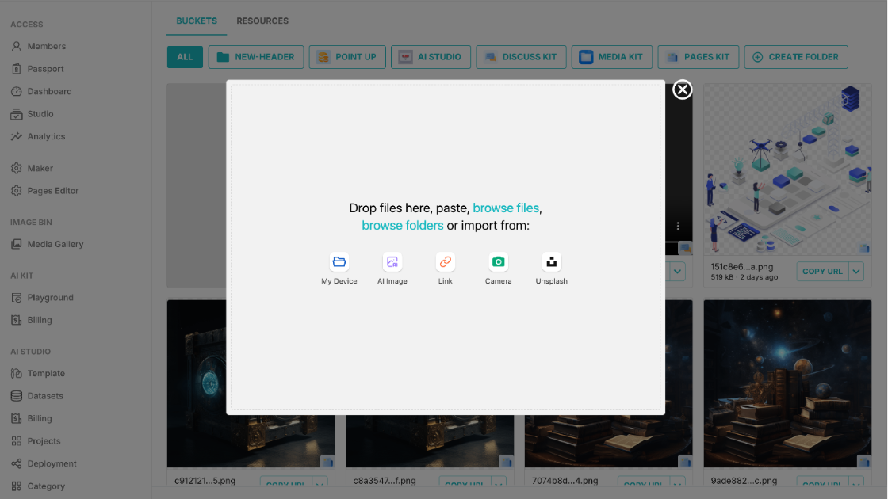
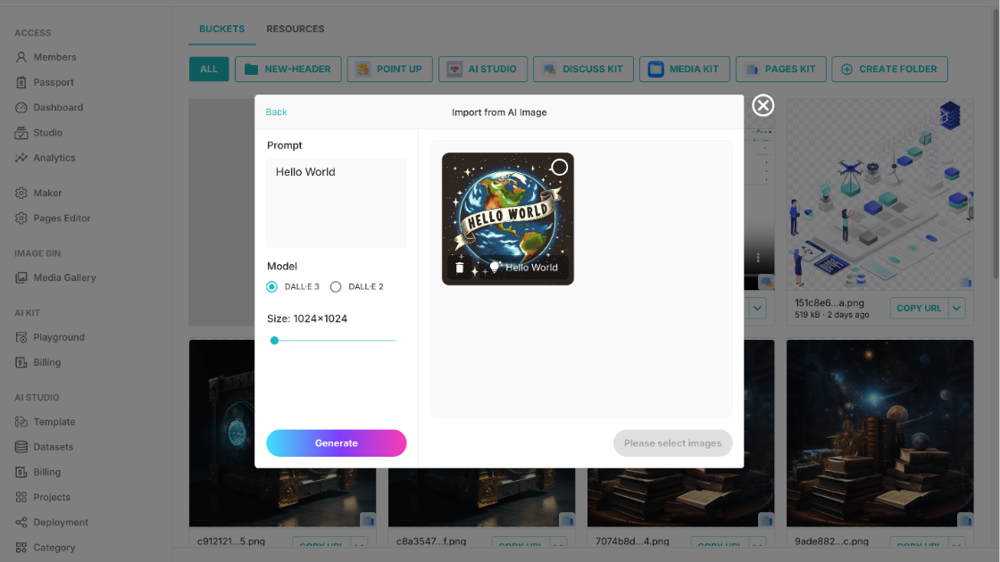
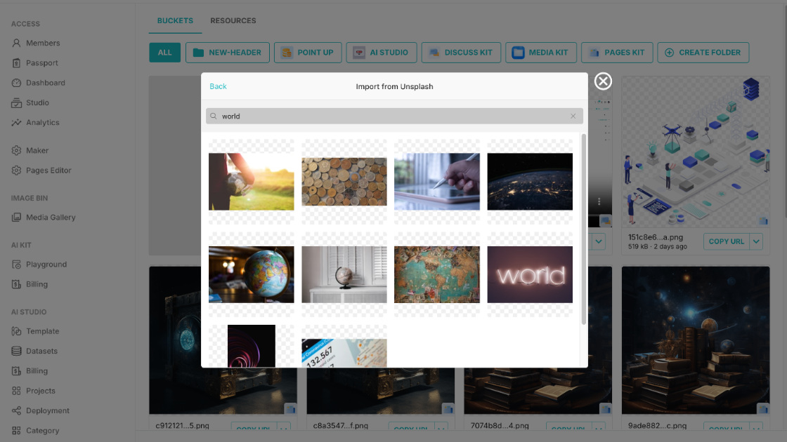

# Media Kit Screenshots Documentation

This document showcases the key features and functionality of Media Kit, a self-hosted media management Blocklet that provides powerful tools for organizing, importing, and generating digital assets.

## Media Gallery Grid View

The main media gallery interface displays your digital assets in a clean grid layout with customizable buckets for organization. Users can filter resources by type (NEW-HEADER, POINT UP, AI STUDIO, DISCUSS KIT, MEDIA KIT, PAGES KIT) and create custom folders. Each image thumbnail shows file details and provides quick access to copy URLs. The left sidebar offers easy navigation to different sections including Members, Passport, Dashboard, Studio, Analytics, Maker, Pages Editor, and the Media Gallery itself.

## Upload Dialog Import Options

The versatile upload dialog provides multiple import methods to add media to your gallery. Users can drag and drop files directly, paste images, browse their local device, generate AI images, import from URL links, use their camera, or search Unsplash's extensive photo library. This modal interface streamlines the media import process by consolidating all upload sources in one convenient location, making it easy to add content from various sources.

## AI Image Generator Dialog

The AI image generation feature allows users to create custom images using DALL-E 3 or DALL-E 2 models directly within the application. Users can enter text prompts to generate unique images and choose their preferred output size (1024×1024 in this example). The interface displays a preview of the generated image with the prompt "Hello World" and a prominent Generate button to create new images. This integration eliminates the need for external AI image generation tools.

## Unsplash Search Integration

Media Kit integrates seamlessly with Unsplash's vast collection of high-quality, free stock photos. Users can search for images directly within the application using keywords (shown here searching for "world"). The search results display as a grid of thumbnails, allowing users to browse and select professional photographs without leaving their media management workflow. This feature is particularly useful for content creators who need quick access to stock imagery.
